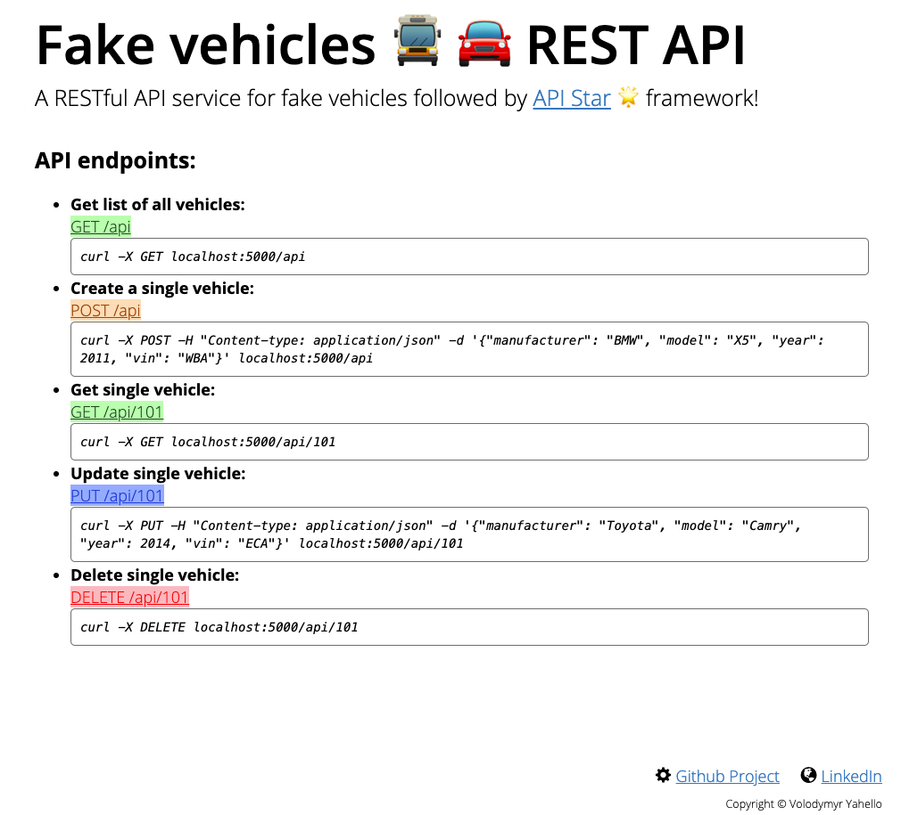

# Mock vehicles API
>A lightweight fake vehicle API written in [API Star](https://docs.apistar.com/) 🌟 python WEB API toolkit framework. 
>This project is built only as a sample REST API toolkit.
>
>Fake data was generated from cool https://www.mockaroo.com source.
>
> You can try it out at [https://fake-vehicles-api.herokuapp.com](https://fake-vehicles-api.herokuapp.com) as it is deployed on heroku.


[](https://travis-ci.org/vyahello/fake-vehicles-api)
[](https://coveralls.io/github/vyahello/fake-vehicles-api?branch=master)

## Tools/features
> - `python 3.8`
> - `RESTful API`
> - `pytest`
> - `travis CI`
> - `heroku`

In addition it is `fully type annotated` and covered with bunch of static code analysis tools like `mypy`, `flake8`, `pylint`, `pydocstyle` and `black`.

## Usage
Run next command from the root of the project:
```bash
~ python vehicle_api.py
```

After please open [localhost:5000/](http://localhost:5000/) or [localhost:5000/index.html](http://localhost:5000/index.html) path in your browser to obtain home page. 
It will show you a page with available endpoints and usage details:



## Development

### API endpoints
There are several endpoints already developed (others will be added soon):
  - `GET` request on `/api` endpoint to get list of all vehicles e.g:
    > `curl localhost:5000/api`
  - `POST` request on `/api` endpoint to create a vehicle e.g:
    > `curl -X POST \` \
    `-H "Content-type: application/json \"` \
    `-d {"manufacturer": "BMW", "model": "X5", "year": 2011, "vin": "WBAWV53589P465532"}' \` \
    `localhost:5000/api`
  - `GET` request on `/api/{id}` endpoint to get single vehicle e.g:
    > `curl localhost:5000/api/99`
  - `PUT` request on `/api/{id}` endpoint to update single vehicle e.g:
    > `curl -X PUT \` \
    `-H "Content-type: application/json" \` \
    `-d '{"manufacturer": "BMW", "model": "X5", "year": 2011, "vin": "WBAWV53589P465532"}' \` \
    `localhost:5000/api/99`
  - `DELETE` request on `/api/{id}` to delete single vehicle e.g:
    > `curl -X DELETE localhost:5000/api/99`

### Testing
Project is covered with both **_unittests_** on code basis and **_functional_** tests on REST API endpoints with [pytest](https://docs.pytest.org/en/latest) testing framework.
It uses [pytest.ini](pytest.ini) configuration file.

Please run next command from the root directory to start testing:
```bash
~ pytest
```
> If you would like to run only `smoke` tests or `unittests` please run tests with corresponding marker e.g:
> 
>`~ pytest -m smoke`

Please open `test-report.html` file in your browser to see testing report.

### Debugging
In case of code debugging please use contemporary [pdb++](https://pypi.org/project/pdbpp) package as an easy-way to track your code.
It is wrapper of a builtin [pbd](https://docs.python.org/3/library/pdb.html) package but with features extensions.

To make it work just install it from `requirements-dev.txt` file and use [breakpoint()](https://docs.python.org/3/library/functions.html#breakpoint) function call e.g:
```python
class A:    
    def do_debug(self) -> None:
        self_: "A" = self
        breakpoint()

a: A = A()
a.do_debug()
```

To be able debug your application please pass `debug=True` parameter into `Setup` object while running an app e.g:
```python
if __name__ == "__main__":
    _run_vehicle_api(Setup(debug=True))
```

### Heroku deployment
Please follow instructions from - https://python-responder.org/en/latest/deployment.html

- Install heroku following by - https://devcenter.heroku.com/articles/heroku-cli#download-and-install
- Configure [Procfile](Procfile)
```text
web: gunicorn vehicle_api:api_app
```
- Create `runtime.txt` file
```text
python-3.8.0
```
- Login to heroku
```bash
heroku login
```
- Create an application
```bash
heroku create fake-vehicles-api
```
- Commit and push repo into a heroku
```bash
git add . && git commit -m "My first heroku app" && git push heroku master
```
- Spin up dynos for web
```bash
heroku ps:scale web=1
```
- Check heroku logs
```bash
heroku logs --tail
```
- Open an application via browser: https://fake-vehicles-api.herokuapp.com

## Release History

* 1.3.1
    * Use "api" endpoint for app APIs
* 1.3.0
    * Deploy app on heroku at https://fake-vehicles-api.herokuapp.com
* 1.2.0
    * Add static code analysis tools
    * Support travis CI
    * Support tests coverage
* 1.1.0
    * Add home page with API description
* 1.0.1
    * Cover app with unittests
* 1.0.0
    * Build basic CRUD API endpoints

## Meta
Author – Volodymyr Yahello vyahello@gmail.com

Distributed under the `MIT` license. See [LICENSE](LICENSE.md) for more information.

You can reach out me at:
* [https://github.com/vyahello](https://github.com/vyahello)
* [https://www.linkedin.com/in/volodymyr-yahello-821746127](https://www.linkedin.com/in/volodymyr-yahello-821746127)

## Contributing
1. clone the repository
2. configure Git for the first time after cloning with your `name` and `email`
3. `pip install -r requirements.txt` to install all project dependencies
4. `pip install -r requirements-dev.txt` to install all development dependencies
